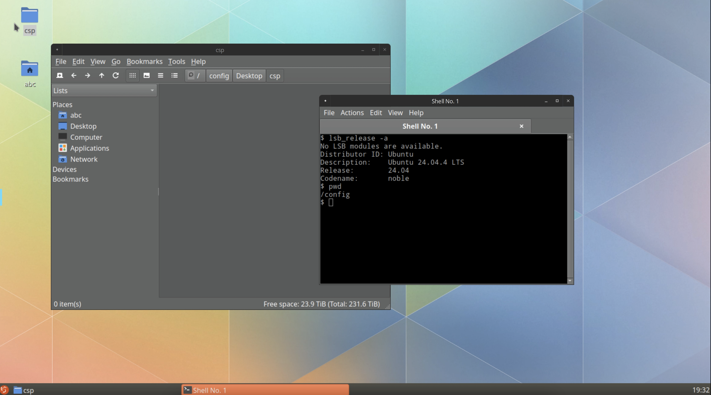

Title: Run Lubuntu Desktop on Docker Using Webtop
Date: 2026-04-19
Category: Docker
Tags: Docker, Lubuntu, Linux, Webtop, Container
Slug: lubuntu-on-docker


### TLDR;

### GitHub Token

To pull container images from GitHub's registry, you need a Personal Access Token (PAT).

1. Go to [GitHub Token Settings](https://github.com/settings/tokens)
2. Click **Generate new token (classic)**
3. Give it a descriptive name and set an expiry
4. Under scopes, check **read:packages**
5. Click **Generate token** and copy it right away — you won't see it again


```
echo <ghp_token> | docker login ghcr.io -u rajacsp --password-stdin

docker pull linuxserver/webtop:ubuntu-lxqt

docker run -d \
  --name=lubuntu \
  -e PUID=1000 \
  -e PGID=1000 \
  -e TZ=America/Toronto \
  -p 3000:3000 \
  -p 3001:3001 \
  -v ~/webtop-config:/config \
  --shm-size="1gb" \
  --restart unless-stopped \
  linuxserver/webtop:ubuntu-lxqt

# Access desktop in browser → http://localhost:3000
# Or via HTTPS → https://localhost:3001

```

### Screenshots

