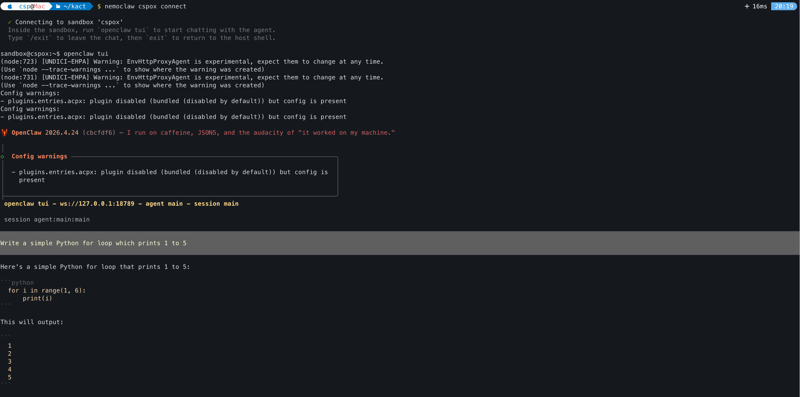

Title: Exploring NemoClaw — NVIDIA's Local AI Agent Sandbox
Date: 2026-05-01
Category: GenAI
Tags: GenAI, LLM, NVIDIA, NemoClaw, Ollama, Docker
Slug: exploring-nemoclaw
Status: draft

NemoClaw is NVIDIA's agent sandbox that lets you run AI assistants locally using your own inference backend — Ollama, llama.cpp, or cloud providers. It bundles OpenShell as a gateway and OpenClaw as the agent runtime, all orchestrated through Docker containers.

Here's a walkthrough of setting it up from scratch.

### Setup

Install the NemoClaw CLI with a single command:

```
curl -fsSL https://nvidia.com/nemoclaw.sh | bash
```

### Onboard

Run the interactive onboarding wizard. It walks you through preflight checks, gateway startup, inference configuration, and sandbox creation.

```
nemoclaw onboard


  NemoClaw Onboarding
  ===================

  [1/8] Preflight checks
  ──────────────────────────────────────────────────
  ✓ Docker is running
  ✓ Container DNS resolution works
  ✓ Container runtime: docker-desktop
  ✓ openshell CLI: openshell 0.0.36
  ✓ Port 8080 available (OpenShell gateway)
  ✓ Apple GPU detected: Apple M4 Max (32 cores), 36864 MB unified memory
  ⓘ Local NIM unavailable — requires NVIDIA GPU

  [2/8] Starting OpenShell gateway
  ──────────────────────────────────────────────────
  Using pinned OpenShell gateway image: ghcr.io/nvidia/openshell/cluster:0.0.36
  Starting gateway cluster...
  Still starting gateway cluster... (5s elapsed)
  Still starting gateway cluster... (10s elapsed)
  Still starting gateway cluster... (20s elapsed)
  Still starting gateway cluster... (30s elapsed)
  Still starting gateway cluster... (40s elapsed)
  Installing OpenShell components...
  Starting OpenShell gateway pod...
  Still starting OpenShell gateway pod... (50s elapsed)
  Waiting for gateway health...
  Waiting for gateway health...
  Gateway container is still running healthy; allowing up to 300s for first-time startup.
  ✓ Gateway is healthy
✓ Active gateway set to 'nemoclaw'

  [3/8] Configuring inference (NIM)
  ──────────────────────────────────────────────────
  Detected local inference option: Ollama


  Inference options:
    1) NVIDIA Endpoints
    2) OpenAI
    3) Other OpenAI-compatible endpoint
    4) Anthropic
    5) Other Anthropic-compatible endpoint
    6) Google Gemini
    7) Local Ollama (localhost:11434) — running (suggested)

  Choose [1]: 7
  ✓ Using Ollama on localhost:11434 (proxy on :11435)

  Ollama models:
    1) qwen3.5:35b
    2) granite3.3:latest
    7) mistral:7b
    ..
    29) gemma3:270m
    30) smollm:135m
    31) qwen3:0.6b
    32) Other...

  Choose model [1]: 1
  Loading Ollama model: qwen3.5:35b
  Chat Completions API available — OpenClaw will use openai-completions.
  Sandbox name (lowercase, starts with letter, hyphens ok) [my-assistant]: cspox

  ──────────────────────────────────────────────────
  Review configuration
  ──────────────────────────────────────────────────
  Provider:      ollama-local
  Model:         qwen3.5:35b
  API key:       (not required for ollama-local)
  Web search:    disabled
  Messaging:     none
  Sandbox name:  cspox
  Note:          Sandbox build takes ~6 minutes on this host.
  ──────────────────────────────────────────────────
  Web search and messaging channels will be prompted next.
  Apply this configuration? [Y/n]: Y

  [4/8] Setting up inference provider
  ──────────────────────────────────────────────────
✓ Active gateway set to 'nemoclaw'
✓ Created provider ollama-local
Gateway inference configured:

  Route: inference.local
  Provider: ollama-local
  Model: qwen3.5:35b
  Version: 1
  Timeout: 180s
  Priming Ollama model: qwen3.5:35b
  ✓ Inference route set: ollama-local / qwen3.5:35b
  Enable Brave Web Search? [y/N]: y

  Get your Brave Search API key from: https://brave.com/search/api/

  Brave Search API key: *******************************
  ✓ Enabled Brave Web Search


  [5/8] Messaging channels
  ──────────────────────────────────────────────────

  Available messaging channels:
    [1] ○ telegram — Telegram bot messaging
    [2] ○ discord — Discord bot messaging
    [3] ● slack — Slack bot messaging

  Press 1-3 to toggle, Enter when done:

  Slack API → Your Apps → OAuth & Permissions → Bot User OAuth Token (xoxb-...).
  Slack Bot Token: **********************************************************
  ✓ slack token saved

  Slack API → Your Apps → Basic Information → App-Level Tokens (xapp-...).
  Slack App Token (Socket Mode): **************************************************************************************************
  ✓ slack app token saved


  [6/8] Creating sandbox
  ──────────────────────────────────────────────────
✓ Created provider cspox-slack-bridge
✓ Created provider cspox-slack-app
✓ Created provider cspox-brave-search
  Creating sandbox 'cspox' (this takes a few minutes on first run)...
  Pinning base image to sha256:6b4542516064...
  Building sandbox image...

```


### Connect to the Sandbox

Once the sandbox is built, connect to it:

```
nemoclaw cspox connect

  ✓ Connecting to sandbox 'cspox'
  Inside the sandbox, run `openclaw tui` to start chatting with the agent.
  Type `/exit` to leave the chat, then `exit` to return to the host shell.

sandbox@cspox:~$
```

### Launch the TUI

Inside the sandbox, start the OpenClaw terminal UI to chat with the agent:

```
openclaw tui

 OpenClaw 2026.4.24 (cbcfdf6) — I run on caffeine, JSON5, and the audacity of "it worked on my machine."

│
◇  Config warnings ───────────────────────────────────────────────────────────────────────╮
│                                                                                         │
│  - plugins.entries.acpx: plugin disabled (bundled (disabled by default)) but config is  │
│    present                                                                              │
│                                                                                         │
├─────────────────────────────────────────────────────────────────────────────────────────╯
 openclaw tui - ws://127.0.0.1:18789 - agent main - session main

 session agent:main:main


Write a simple Python for loop which prints 1 to 5


Here's a simple Python for loop that prints 1 to 5:

```python
  for i in range(1, 6):
      print(i)
```

This will output:

```
  1
  2
  3
  4
  5
```

```





### Using llama.cpp with NemoClaw

You can also point NemoClaw at a llama.cpp server running on your host instead of Ollama.

```
# 1. Start llama-server on host (outside sandbox)
./build/bin/llama-server \
  -m ./models/your-model.gguf \
  --ctx-size 16384 \
  --host 0.0.0.0 \
  --port 9090 \
  --jinja

# 2. Register it as a provider inside NemoClaw
openshell provider create \
  --name llama-local \
  --type openai \
  --credential OPENAI_API_KEY=none \
  --config OPENAI_BASE_URL=http://<YOUR_HOST_IP>:9090/v1

# 3. Set it as active inference
openshell inference set \
  --provider llama-local \
  --model your-model.gguf \
  --no-verify
  
```