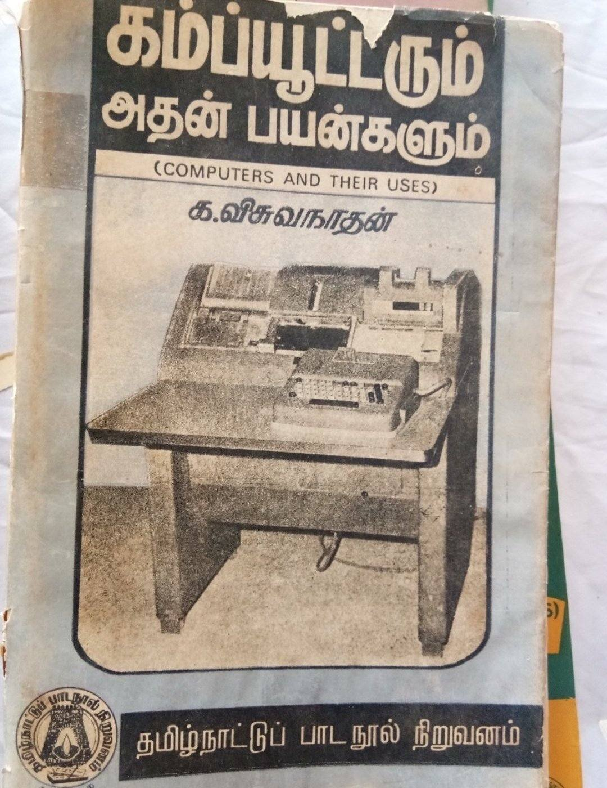
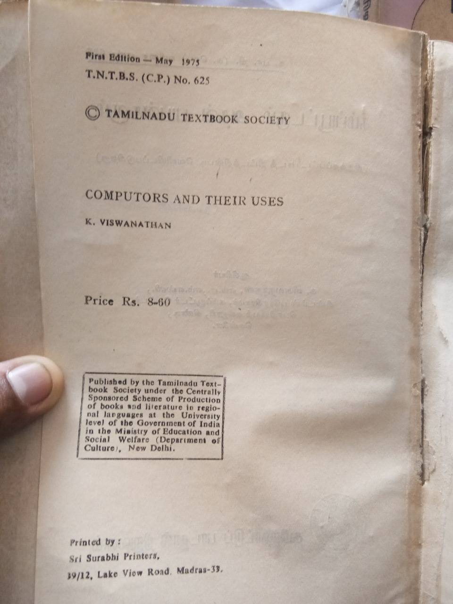
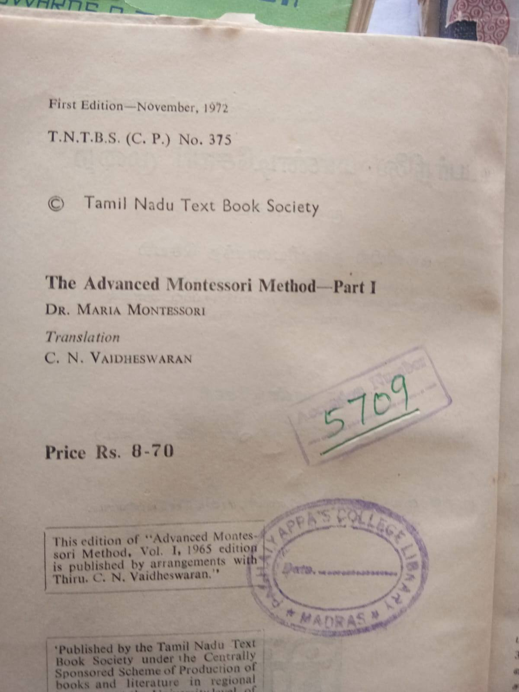
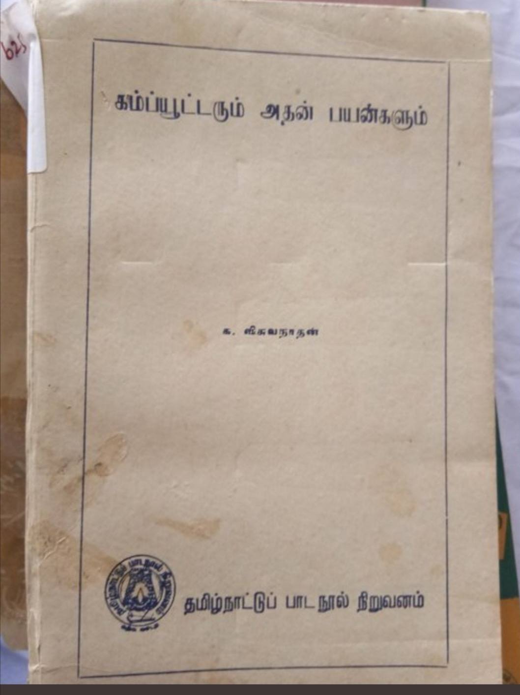

Title: How Tamil Nadu Government Paved My Computer Dream
Date: 2026-05-02
Category: Life
Tags: life, education, tamilnadu, personal
Slug: 2026-05-02-how-tamilnadu-govt-paved-my-computer-dream

When I was in 11th grade, my school — a Government Higher Secondary School — got its first color computer.

Even though I was a Bio-Maths student, the school management made a great call: one mandatory computer session every Friday for all 11th and 12th graders.

Our computer teacher had a tradition. He'd give us a puzzle each Friday, and whoever cracked it first earned the privilege of touching the keyboard — typing a few lines, drawing something on MS Paint.

I got lucky on a Friday the 13th. I solved the puzzle and finally got to touch the keyboard.

The moment my fingers hit the keys, I swear I could hear Illayaraja's music playing in the background. That's when the excitement began.

Fast forward almost 26 years — I still hear Illayaraja's songs every time I sit down at a keyboard. Of course, the fact that it's a MacBook now is the icing on the cake.

Education is the greatest weapon of all time, and I got mine with the help of Kalaignar.

Thanks to Kalaignar and his education policies — they changed everything.

