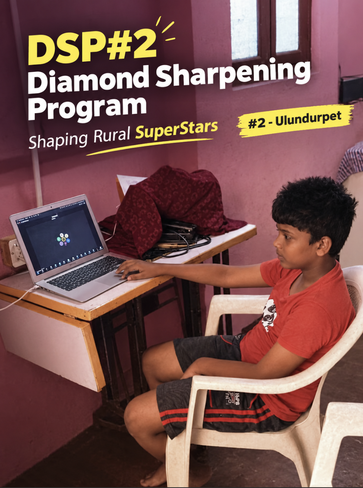

Title: Found our second diamond via our DSP: Prasanna
Date: 2026-09-08
Category: Community
Tags: DSP, Kactii, Community Support, MacBook
Slug: dsp-2-prasanna
Status: Published
Cover: image/2026-09-07-dsp-2-pg-prasanna/1788926638075.png

The Diamond Sourcing Program (DSP) is a community support initiative personally funded by Raja CSP Raman via Kactii. Through our DSP, we find fresh diamonds — people whose efforts and dreams deserve recognition, but who may not yet have the tools to fully chase them. As a gesture of appreciation, we offer an old MacBook to support them on their journey. This is not a grant, a scholarship, or a contract — it is simply a community gesture, given with no strings attached. Full details live at [https://wiki.kactii.com/dsp.html](https://wiki.kactii.com/dsp.html).

## What the DSP Is About

**A Small Tool, A Big Message** A used MacBook may seem like a modest gift, but its real value is the message behind it: someone sees your effort, believes in your dreams, and wants you to keep going. Sometimes that belief is the push a person needs.

**Community, Not Charity** The DSP is built on the idea of a community lifting up its own. We are not looking for the most accomplished or the most credentialed — we are looking for genuine effort and honest dreams, wherever they come from.

**Personally Funded** Every device in this program is funded personally by Raja CSP Raman through Kactii. It reflects a personal commitment to giving back, one diamond at a time.

## Season 2

**A New Season, A New Diamond** Season 2 continues what Season 1 began: finding people who are quietly working toward something meaningful and giving them a small boost. Each season, we hope to widen the circle a little more.

**Second Recipient** In Season 2, we are glad to hand over our second MacBook to a deserving diamond — the second recipient in the history of the program.

**P.G.Prasanna** Based in Ulundurpet, Tamil Nadu, India, Prasanna is the recipient of DSP #2. This MacBook is a small token to appreciate his efforts and dreams. We are proud to welcome him into the growing DSP family.

## Looking Ahead

**More Diamonds to Come** Prasanna is the second of many. As the program grows, we look forward to discovering more fresh diamonds and celebrating the effort and ambition that so often goes unseen.

**Know a Diamond?** If you know someone whose effort and dreams deserve a little recognition, the DSP is always looking. Learn more and reach out at [https://wiki.kactii.com/dsp.html](https://wiki.kactii.com/dsp.html).
